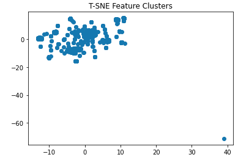
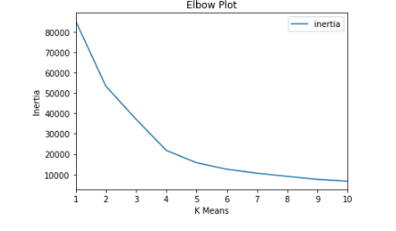

# Cryptocurrency Clusters


## About this Project

* A prominent investment bank, is interested in offering a new cryptocurrency investment portfolio for its customers. The company, however, is lost in the vast universe of cryptocurrencies. They would like a report that includes what cryptocurrencies are on the trading market and determine whether they can be grouped to create a classification system for this new investment.

* The First step will be to pre-process the raw data to fit the machine learning models. Since there is no known classification system, I will need to use unsupervised learning. I will be using several clustering algorithms to explore whether the cryptocurrencies can be grouped together with other similar cryptocurrencies. In the end, I will be making use of data visualization to share my findings with the investment bank.

## Data Preparation

* Read `crypto_data.csv` into Pandas. The dataset was obtained from [CryptoCompare](https://min-api.cryptocompare.com/data/all/coinlist).

```python
#Read crypto_data.csv into pandas
crypto_data = "resources/data/crypto_data.csv"
crypto_df = pd.read_csv(crypto_data)
crypto_df.head(10)
```

* Discard all cryptocurrencies that are not being traded. In others words, filter all currencies that are currently being traded. 
Once this is done, we drop the `IsTrading` column from the dataframe.

```python
#Discard all cryptocurrencies that are not being traded
crypto_df = crypto_df[crypto_df['IsTrading'] == True]
crypto_df.head(10)
```

```python
#Drop IsTrading column from the dataframe
crypto_df.drop(columns=['IsTrading'], inplace=True)
crypto_df
```

* Remove all rows that have at least one null vlaue.

```python
#Remove all rows that have at least one null value
crypto_df.dropna(inplace=True)
crypto_df.head(10)
```

* Filter all cryptocurrencies that have been mined, that are greater than zero.

```python
#Filter cryptocurrencies that have been mined
crypto_df = crypto_df[crypto_df['TotalCoinsMined'] > 0]
crypto_df
```

* In order for the dataset to be comprehensible to a machine learning algorithm, its data should be numeric. Since the coin names do not contribute to the analysis of the data, I will delete the `CoinName` from the original dataframe.

```python
#Drop'CoinName' from the orginal dataframe since it cannot be used by the clustering Algorithm
crypto_df = crypto_df.drop(columns=["CoinName", "Unnamed: 0"])
crypto_df
```

* Converting remaining features with text values, `Algorithm` and `ProofType`, into numerical data,using Pandas to create dummy variables.

```python
#Convert text features to numeric data
X = pd.get_dummies(crypto_df, columns=['Algorithm', 'ProofType'])
X.head(10)
```

* Standardize the dataset so that columns that contain larger values do not unduly influence the outcome.

```python
#Standardize the dataset using sklearn StandardScaler
X_scaled = StandardScaler().fit_transform(X)
X_scaled
```

## Dimensionality Reduction

* Using PCA(n_components=0.90) creates a model that will preserve approximately 90% of the explained variance in dimensionality reduction.

```python
# Reduce dimension with PCA 
pca = PCA(n_components=.90)
principal_compnenets = pca.fit_transform(X_scaled)
principal_compnenets.shape
```
output: (532, 74)

```python
# Variance levels display of the princiapl_components line above
print(pca.explained_variance_.sum())
```
output: 88.47283457566152

* Further reduce the dataset dimensions with t-SNE and visually inspect the results by running t-SNE on the principal components: the output of the PCA transformation.

```python
# Reduce dimensions with t-SNE
tsne = TSNE(perplexity=50)
tsne_feature = tsne.fit_transform(principal_compnenets)
tsne_feature.shape
```
output: (532, 2)

## Clustering with K-Means

* Create a scatter plot of the t-SNE output to observe whether there are distinct clusters or not.

```python
# Plot T-SNE features
X = tsne_feature[:,0]
y = tsne_feature[:,1]

# Display plt
plt.scatter(X,y)
plt.title("T-SNE Feature Clusters")
plt.show()
```


* Use a for-loop to determine the inertia for each k between 1 through 10.

```python
# Identify cluster with k-means
inertia = []
k = list(range(1,11))

for i in k:
    kmeans = KMeans(n_clusters=i, random_state=0)
    kmeans.fit(principal_compnenets)
    inertia.append(kmeans.inertia_)
```

* Create an elbow plot to identify the best number of clusters.

```python
# Create the elbow curve
elbow_df = pd.DataFrame({"k": k, "inertia": inertia})
elbow_df.plot.line(x="k", y="inertia")
plt.xlabel("K Means")
plt.ylabel("Inertia")
plt.title("Elbow Plot")
plt.show()
```


## Recomendations
Based on my findings, there is not enough features in the dataset to extact a meaningful grouping. Our elbow chart trends downwards with no elbow point,  there is not enough of an 'elbow' in our K-Means plot to signify a meaningful cluster in this dataset. This clustering did not provide much insight into the cryptocurrency trends. More features should be added.

## References

Crypto Coin Comparison Ltd. (2020) Coin market capitalization lists of crypto currencies and prices. Retrieved from [https://www.cryptocompare.com/coins/list/all/USD/1](https://www.cryptocompare.com/coins/list/all/USD/1)
